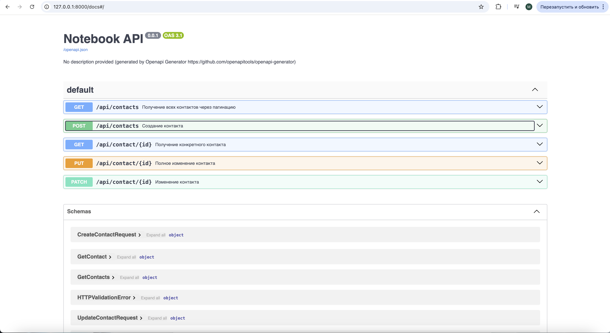

# OpenAPI generated FastAPI server

This Python package is automatically generated by the [OpenAPI Generator](https://openapi-generator.tech) project:

- API version: 0.0.1
- Generator version: 7.20.0
- Build package: org.openapitools.codegen.languages.PythonFastAPIServerCodegen

## Requirements.

Python >= 3.10

## Installation & Usage

To run the server, please execute the following from the root directory:

```bash
pip3 install -r requirements.txt
PYTHONPATH=src uvicorn openapi_server.main:app --host 0.0.0.0 --port 8080
```

and open your browser at `http://localhost:8080/docs/` to see the docs.

## Running with Docker

To run the server on a Docker container, please execute the following from the root directory:

```bash
docker compose up --build
```

## Tests

To run the tests:

```bash
pip3 install pytest
PYTHONPATH=src pytest tests
```



## Метрики

### Рост запросов


### Количество запросов по эндпоинтам


### 90 квантиль продолжительности запросов


### Распределение контактов по возрасту


## Логирование
Были добавлены базовые логи в сервис через встроенную библиотеку питона logging, они пишутся в файл /var/log/myapp/app.log. Был развернут promtail, который забирает их и отправляет в loki. В графане подключен loki как datasource. Пример выполнения запроса в графане:


## Трейсы
Настроил автогенерацию для эндпоинтов через билиотеку opentelemetry. Далее развернул otl-collector, в него отправлял трейсы. И развернул tempo, для хранения трейсов, otl-collector ему отправлял трейсы. В графане добавил датасорс соответственно с tempo, трейсы есть, отображаются:

Поделал запросы:


